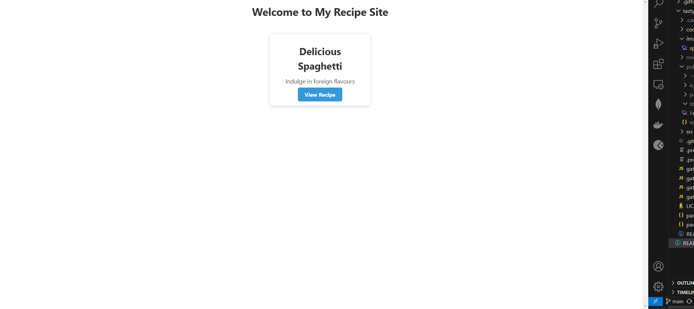

## Authors
Kyle Stevens
Tonnette Cunningham
Bhavya Mungra
Josh Runas

## Project Details/Overview
Built with Gatsby,this is a static site perfect for aspiring chefs and home cooks who want to share their recipes in a visually appealing and organized way. Chefs can now create a recipe e-book without the need for a database or CMS, making it a lightweight, fast, and easy-to-manage website.


## 🚀 Quick start
Navigate into the site’s directory to start it up. Commands are listed below.
```shell
npm install
npm install -g gatsby-cli
gatsby develop
```
The site is now running at `http://localhost:8000`!

When you open the URL above you should see a page that looks like to this


Note: You'll also see a second link: `http://localhost:8000/___graphql`. This is a tool you can use to experiment with querying your data. Learn more about using this tool in the [Gatsby Tutorial](https://www.gatsbyjs.com/docs/tutorial/getting-started/part-4/#use-graphiql-to-explore-the-data-layer-and-write-graphql-queries).


## Live Deployed Site

You can view the live version of the site at:

[https://e-book-tasty-recipes.vercel.app/](https://e-book-tasty-recipes.vercel.app/)


---------------------------------xxxxxx-----------------------------------------------
Below are the instructions for adding recipe pages to the site using plugins, rather than relying solely on the index file that the project is built on.

# Adding a New Recipe Page

To add a new recipe page to the site, follow these steps:

## 1. Navigate to the Recipes Directory  
All recipe pages should be stored as Markdown (`.md`) files inside the `src/pages/recipes/` directory.  
If this folder does not exist, create it.

## 2. Create a New Markdown File  
Each recipe should be written in a separate Markdown file. Create a new file inside `src/pages/recipes/` and name it appropriately, such as `chocolate-cake.md`.

## 3. Add Frontmatter to the Markdown File  
At the beginning of the file, include frontmatter metadata that provides necessary details:

```yaml
---
title: "Chocolate Cake"
date: "2025-02-21"
author: "John Doe"
slug: "chocolate-cake"
tags: ["dessert", "chocolate"]
ingredients:
  - "2 cups flour"
  - "1 cup sugar"
  - "1/2 cup cocoa powder"
  - "1 tsp baking powder"
  - "1/2 tsp salt"
instructions:
  - "Preheat the oven to 350°F (175°C)."
  - "Mix all dry ingredients in a bowl."
  - "Add wet ingredients and stir until smooth."
  - "Pour into a greased pan and bake for 30 minutes."
---
```

Below the frontmatter, add a description and steps in Markdown format.
---
## Preparation
This chocolate cake is easy to make and delicious!  
Follow these steps for the best results.
---

## Additional Notes
- The site uses gatsby-source-filesystem and gatsby-transformer-remark to process Markdown files. Ensure these plugins are configured in gatsby-config.js.
- Recipe pages are generated dynamically in gatsby-node.js.

## 1 Example of MD FILE "chocolate-cake.md" in folder src/pages/recipes/chocolate-cake.md